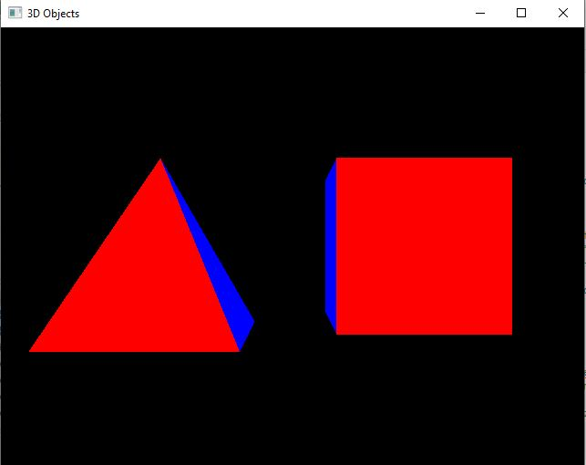

# CompSciCaptsone

<h1>Algorithms & Data Structures</h1>

## Narrative

### Briefly describe the artifact. What is it? When was it created?

The original artifact is a C++ program that is designed to create 3D objects. To be specific, the program creates a pyramid that consists of 4 triangle sides and a cube that consists of 6 square sides. Each side of both objects has a different color designated for it. The original artifact was created during my time in the CS 330: Computational Graphics and Visualization here at SNHU.
   
### Justify the inclusion of the artifact in your ePortfolio. Why did you select this item? What specific components of the artifact showcase your skills and abilities in # software development? How was the artifact improved?

The reason that I selected this item was because I felt it would be a good example of my ability and understanding of algorithms and data structures in programming. Specifically, I feel that the methods and functions included in this bit of code, with such a consolidated main method really showcases my skills and abilities in software development. The way that I chose to improve/enhance the artifact was by taking the program that simply outputted the two stationary objects and adding code to actually give some “life” to the objects and have them rotate automatically in their window so that we can see all sides and colors of the objects, rather than just the two sides of each that were visible in the original artifact. 


## Original 3D Shapes C++

```C++
/*
 *3D Objects.cpp
 *
 *  Created on: Dec 6, 2020
 *      Author: Corey Dalton
 */


#include <windows.h>  // for MS Windows
#include <GL/glut.h>  // GLUT, include glu.h and gl.h

/* Global variables */
char title[] = "3D Objects";

/* Initialize OpenGL Graphics */
void initGL() {
   glClearColor(0.0f, 0.0f, 0.0f, 1.0f); // Set background color to black and opaque
   glClearDepth(1.0f);                   // Set background depth to farthest
   glEnable(GL_DEPTH_TEST);   // Enable depth testing for z-culling
   glDepthFunc(GL_LEQUAL);    // Set the type of depth-test
   glShadeModel(GL_SMOOTH);   // Enable smooth shading
   glHint(GL_PERSPECTIVE_CORRECTION_HINT, GL_NICEST);  // Perspective corrections
}

/* Handler for window-repaint event. Called back when the window first appears and
   whenever the window needs to be re-painted. */
void display() {
   glClear(GL_COLOR_BUFFER_BIT | GL_DEPTH_BUFFER_BIT); // Clear color and depth buffers
   glMatrixMode(GL_MODELVIEW);     // To operate on model-view matrix

   // Render a color-cube consisting of 6 quads with different colors
   glLoadIdentity();                 // Reset the model-view matrix
   glTranslatef(1.5f, 0.0f, -7.0f);  // Move right and into the screen

   glBegin(GL_QUADS);                // Begin drawing the color cube with 6 quads
      // Define vertices in counter-clockwise order with normal pointing out
   	  // Side 1
      glColor3f(1.0f, 0.0f, 0.0f);     // Red
      glVertex3f( 1.0f,  1.0f, 1.0f);
      glVertex3f(-1.0f,  1.0f, 1.0f);
      glVertex3f(-1.0f, -1.0f, 1.0f);
      glVertex3f( 1.0f, -1.0f, 1.0f);

      // Side 2
      glColor3f(0.0f, 0.0f, 1.0f);     // Blue
      glVertex3f(-1.0f,  1.0f,  1.0f);
      glVertex3f(-1.0f,  1.0f, -1.0f);
      glVertex3f(-1.0f, -1.0f, -1.0f);
      glVertex3f(-1.0f, -1.0f,  1.0f);

      //Side 3
      glColor3f(0.0f, 1.0f, 0.0f);     // Green
      glVertex3f( 1.0f, 1.0f, -1.0f);
      glVertex3f(-1.0f, 1.0f, -1.0f);
      glVertex3f(-1.0f, 1.0f,  1.0f);
      glVertex3f( 1.0f, 1.0f,  1.0f);

      // Side 4
      glColor3f(1.0f, 0.5f, 0.0f);     // Orange
      glVertex3f( 1.0f, -1.0f,  1.0f);
      glVertex3f(-1.0f, -1.0f,  1.0f);
      glVertex3f(-1.0f, -1.0f, -1.0f);
      glVertex3f( 1.0f, -1.0f, -1.0f);

      // Side 5
      glColor3f(1.0f, 1.0f, 0.0f);     // Yellow
      glVertex3f( 1.0f, -1.0f, -1.0f);
      glVertex3f(-1.0f, -1.0f, -1.0f);
      glVertex3f(-1.0f,  1.0f, -1.0f);
      glVertex3f( 1.0f,  1.0f, -1.0f);

      // Side 6
      glColor3f(1.0f, 0.0f, 1.0f);     // Magenta
      glVertex3f(1.0f,  1.0f, -1.0f);
      glVertex3f(1.0f,  1.0f,  1.0f);
      glVertex3f(1.0f, -1.0f,  1.0f);
      glVertex3f(1.0f, -1.0f, -1.0f);
   glEnd();  // Cube finished

   // Render a pyramid consists of 4 triangles
   glLoadIdentity();                  // Reset the model-view matrix
   glTranslatef(-1.5f, 0.0f, -6.0f);  // Move left and into the screen

   glBegin(GL_TRIANGLES);           // Begin drawing the pyramid with 4 triangles
      // Triangle - Red
      glColor3f(1.0f, 0.0f, 0.0f);
      glVertex3f( 0.0f, 1.0f, 0.0f);
      glColor3f(1.0f, 0.0f, 0.0f);
      glVertex3f(-1.0f, -1.0f, 1.0f);
      glColor3f(1.0f, 0.0f, 0.0f);
      glVertex3f(1.0f, -1.0f, 1.0f);

      // Triangle 2 - Blue
      glColor3f(0.0f, 0.0f, 1.0f);
      glVertex3f(0.0f, 1.0f, 0.0f);
      glColor3f(0.0f, 0.0f, 1.0f);
      glVertex3f(1.0f, -1.0f, 1.0f);
      glColor3f(0.0f, 0.0f, 1.0f);
      glVertex3f(1.0f, -1.0f, -1.0f);

      // Triangle 3 - Green
      glColor3f(0.0f, 1.0f, 0.0f);
      glVertex3f(0.0f, 1.0f, 0.0f);
      glColor3f(0.0f, 1.0f, 0.0f);
      glVertex3f(1.0f, -1.0f, -1.0f);
      glColor3f(0.0f, 1.0f, 0.0f);
      glVertex3f(-1.0f, -1.0f, -1.0f);

      // Triangle 4 - Orange
      glColor3f(1.0f, 0.5f, 0.0f);
      glVertex3f( 0.0f, 1.0f, 0.0f);
      glColor3f(1.0f, 0.5f, 0.0f);
      glVertex3f(-1.0f,-1.0f,-1.0f);
      glColor3f(1.0f, 0.5f, 0.0f);
      glVertex3f(-1.0f,-1.0f, 1.0f);

   glEnd();   // Pyramid finished

   glutSwapBuffers();  // Swap the front and back frame buffers (double buffering)

}

/* Handler for window re-size event. Called back when the window first appears and
   whenever the window is re-sized with its new width and height */
void reshape(GLsizei width, GLsizei height) {  // GLsizei for non-negative integer
   // Compute aspect ratio of the new window
   if (height == 0) height = 1;                // To prevent divide by 0
   GLfloat aspect = (GLfloat)width / (GLfloat)height;

   // Set the viewport to cover the new window
   glViewport(0, 0, width, height);

   // Set the aspect ratio of the clipping volume to match the viewport
   glMatrixMode(GL_PROJECTION);  // To operate on the Projection matrix
   glLoadIdentity();             // Reset
   // Enable perspective projection with fovy, aspect, zNear and zFar
   gluPerspective(45.0f, aspect, 0.1f, 100.0f);
}

/* Main function: GLUT runs as a console application starting at main() */
int main(int argc, char** argv) {
   glutInit(&argc, argv);            // Initialize GLUT
   glutInitDisplayMode(GLUT_DOUBLE); // Enable double buffered mode
   glutInitWindowSize(640, 480);   // Set the window's initial width & height
   glutInitWindowPosition(50, 50); // Position the window's initial top-left corner
   glutCreateWindow(title);          // Create window with the given title
   glutDisplayFunc(display);       // Register callback handler for window re-paint event
   glutReshapeFunc(reshape);       // Register callback handler for window re-size event
   initGL();                       // Our own OpenGL initialization
   glutMainLoop();                 // Enter the infinite event-processing loop
   return 0;
}

```
<center></center>

## Enahnced Rotating 3D Shapes C++

```C++
/*
 *3D Objects.cpp
 *
 *  Created on: Dec 6, 2020
 *  Enhanced: 8/1/21  
 *      Author: Corey Dalton
 */


#include <windows.h>  // for MS Windows
#include <GL/glut.h>  // GLUT, include glu.h and gl.h

/* Global variables */
char title[] = "3D Objects";
GLfloat cubeRotate = 0.0f;      //Rotate cube var
GLfloat pyramidRotate = 0.0f;   //Rotate pyramid var
int intervalRefresh = 20;         //Interval refresh var

/* Initialize OpenGL Graphics */
void initGL() {
   glClearColor(0.0f, 0.0f, 0.0f, 1.0f); // Set background color to black and opaque
   glClearDepth(1.0f);                   // Set background depth to farthest
   glEnable(GL_DEPTH_TEST);   // Enable depth testing for z-culling
   glDepthFunc(GL_LEQUAL);    // Set the type of depth-test
   glShadeModel(GL_SMOOTH);   // Enable smooth shading
   glHint(GL_PERSPECTIVE_CORRECTION_HINT, GL_NICEST);  // Perspective corrections
}

/* Handler for window-repaint event. Called back when the window first appears and
   whenever the window needs to be re-painted. */
void display() {
   glClear(GL_COLOR_BUFFER_BIT | GL_DEPTH_BUFFER_BIT); // Clear color and depth buffers
   glMatrixMode(GL_MODELVIEW);     // To operate on model-view matrix

   // Render a color-cube consisting of 6 quads with different colors
   glLoadIdentity();                 // Reset the model-view matrix
   glTranslatef(1.5f, 0.0f, -7.0f);  // Move right and into the screen
   glRotatef(cubeRotate, 1.0f, 0.0f, 1.0f); //Cube rotate to see 6 square sides

   glBegin(GL_QUADS);                // Begin drawing the color cube with 6 quads
      // Define vertices in counter-clockwise order with normal pointing out
   	  // Side 1
      glColor3f(1.0f, 0.0f, 0.0f);     // Red
      glVertex3f( 1.0f,  1.0f, 1.0f);
      glVertex3f(-1.0f,  1.0f, 1.0f);
      glVertex3f(-1.0f, -1.0f, 1.0f);
      glVertex3f( 1.0f, -1.0f, 1.0f);

      // Side 2
      glColor3f(0.0f, 0.0f, 1.0f);     // Blue
      glVertex3f(-1.0f,  1.0f,  1.0f);
      glVertex3f(-1.0f,  1.0f, -1.0f);
      glVertex3f(-1.0f, -1.0f, -1.0f);
      glVertex3f(-1.0f, -1.0f,  1.0f);

      //Side 3
      glColor3f(0.0f, 1.0f, 0.0f);     // Green
      glVertex3f( 1.0f, 1.0f, -1.0f);
      glVertex3f(-1.0f, 1.0f, -1.0f);
      glVertex3f(-1.0f, 1.0f,  1.0f);
      glVertex3f( 1.0f, 1.0f,  1.0f);

      // Side 4
      glColor3f(1.0f, 0.5f, 0.0f);     // Orange
      glVertex3f( 1.0f, -1.0f,  1.0f);
      glVertex3f(-1.0f, -1.0f,  1.0f);
      glVertex3f(-1.0f, -1.0f, -1.0f);
      glVertex3f( 1.0f, -1.0f, -1.0f);

      // Side 5
      glColor3f(1.0f, 1.0f, 0.0f);     // Yellow
      glVertex3f( 1.0f, -1.0f, -1.0f);
      glVertex3f(-1.0f, -1.0f, -1.0f);
      glVertex3f(-1.0f,  1.0f, -1.0f);
      glVertex3f( 1.0f,  1.0f, -1.0f);

      // Side 6
      glColor3f(1.0f, 0.0f, 1.0f);     // Purple
      glVertex3f(1.0f,  1.0f, -1.0f);
      glVertex3f(1.0f,  1.0f,  1.0f);
      glVertex3f(1.0f, -1.0f,  1.0f);
      glVertex3f(1.0f, -1.0f, -1.0f);
   glEnd();  // Cube finished

   // Render a pyramid consists of 4 triangles
   glLoadIdentity();                  // Reset the model-view matrix
   glTranslatef(-1.5f, 0.0f, -6.0f);  // Move left and into the screen
   glRotatef(pyramidRotate, 0.0f, 1.0f, 0.0f);  //Rotate pyramid to view 4 triangle sides

   glBegin(GL_TRIANGLES);           // Begin drawing the pyramid with 4 triangles
      // Triangle - Red
      glColor3f(1.0f, 0.0f, 0.0f);
      glVertex3f( 0.0f, 1.0f, 0.0f);
      glColor3f(1.0f, 0.0f, 0.0f);
      glVertex3f(-1.0f, -1.0f, 1.0f);
      glColor3f(1.0f, 0.0f, 0.0f);
      glVertex3f(1.0f, -1.0f, 1.0f);

      // Triangle 2 - Blue
      glColor3f(0.0f, 0.0f, 1.0f);
      glVertex3f(0.0f, 1.0f, 0.0f);
      glColor3f(0.0f, 0.0f, 1.0f);
      glVertex3f(1.0f, -1.0f, 1.0f);
      glColor3f(0.0f, 0.0f, 1.0f);
      glVertex3f(1.0f, -1.0f, -1.0f);

      // Triangle 3 - Green
      glColor3f(0.0f, 1.0f, 0.0f);
      glVertex3f(0.0f, 1.0f, 0.0f);
      glColor3f(0.0f, 1.0f, 0.0f);
      glVertex3f(1.0f, -1.0f, -1.0f);
      glColor3f(0.0f, 1.0f, 0.0f);
      glVertex3f(-1.0f, -1.0f, -1.0f);

      // Triangle 4 - Orange
      glColor3f(1.0f, 0.5f, 0.0f);
      glVertex3f( 0.0f, 1.0f, 0.0f);
      glColor3f(1.0f, 0.5f, 0.0f);
      glVertex3f(-1.0f,-1.0f,-1.0f);
      glColor3f(1.0f, 0.5f, 0.0f);
      glVertex3f(-1.0f,-1.0f, 1.0f);

   glEnd();   // Pyramid finished

   glutSwapBuffers();  // Swap the front and back frame buffers (double buffering)

   //Rotation updates for cube and pyramid
   cubeRotate += 1.0f;
   pyramidRotate += 1.0f;

}

/* Handler for window re-size event. Called back when the window first appears and
   whenever the window is re-sized with its new width and height */
void reshape(GLsizei width, GLsizei height) {  // GLsizei for non-negative integer
   // Compute aspect ratio of the new window
   if (height == 0) height = 1;                // To prevent divide by 0
   GLfloat aspect = (GLfloat)width / (GLfloat)height;

   // Set the viewport to cover the new window
   glViewport(0, 0, width, height);

   // Set the aspect ratio of the clipping volume to match the viewport
   glMatrixMode(GL_PROJECTION);  // To operate on the Projection matrix
   glLoadIdentity();             // Reset
   // Enable perspective projection with fovy, aspect, zNear and zFar
   gluPerspective(45.0f, aspect, 0.1f, 100.0f);
}

void timer(int value) {
	glutPostRedisplay();    // Redisplay request
	glutTimerFunc(intervalRefresh, timer, 0);  // Refresh request
}

/* Main function: GLUT runs as a console application starting at main() */
int main(int argc, char** argv) {
   glutInit(&argc, argv);            // Initialize GLUT
   glutInitDisplayMode(GLUT_DOUBLE); // Enable double buffered mode
   glutInitWindowSize(640, 480);   // Set the window's initial width & height
   glutInitWindowPosition(50, 50); // Position the window's initial top-left corner
   glutCreateWindow(title);          // Create window with the given title
   glutDisplayFunc(display);       // Register callback handler for window re-paint event
   glutReshapeFunc(reshape);       // Register callback handler for window re-size event
   initGL();                       // Our own OpenGL initialization
   glutTimerFunc(0, timer, 0);     // Call first instance of timer
   glutMainLoop();                 // Enter the infinite event-processing loop
   return 0;
}

```
<center></center>

### Reflect on the process of enhancing and/or modifying the artifact. What did you learn as you were creating it and improving it? What challenges did you face?
Throughout the process of enhancing this artifact, I learned how to code the objects to move on their own in a controlled manner. One of the biggest challenges that I faced was refreshing myself on how OpenGL worked since I hadn’t dealt with it since I was enrolled in the CS 330 course about 10 months ago. I also found it slightly challenging to create the rotation of the objects in a controlled manner, where all sides of both objects would be seen at some point and there would be no collision or overlapping between the objects. 

